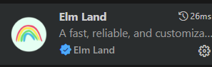

# B1 portfolio website

Esta es una web estilo SPA (Single Page Application) desarrollada en ELM. Visita la web en [mikeldalmau.uk](https://mikeldalmau.uk)

- [B1 portfolio website](#b1-portfolio-website)
  - [Ejecutar el entorno de desarrollo](#ejecutar-el-entorno-de-desarrollo)
    - [Troubleshooting :wrench:](#troubleshooting-wrench)
  - [Preparar la web para producción :rocket:](#preparar-la-web-para-producción-rocket)
    - [Troubleshooting :wrench:](#troubleshooting-wrench-1)
  - [Extensiones Recomendadas :rainbow:](#extensiones-recomendadas-rainbow)


## Ejecutar el entorno de desarrollo 

El entorno de desarrollo utiliza un único contenedor Debian con node y elm. Para ejecutarlo es necesario tener instalado Docker y Docker Compose.

```bash
docker compose up --build
```

Un vez que la imagen del contenedor esté construida y el contenedor esté en ejecución, se puede acceder a la web en la dirección http://localhost:8000. Ya no hace flata que agregues el el parametro --build, a menos que quieras reconstruir la imagen.

```bash
docker compose up
```

Es apropiado en este caso no usar el parametro `-d` ya que se necesita ver la salida de la consola para ver los mensajes de error del live server y de la compilación de elm. 


### Troubleshooting :wrench:

Si tienes problemas con la descarga de paquetes de debian al construir el contenedor, en windows puedes intentar con el siguiente comando: `ipconfig /flushdns` para borrar el cache de la resolución de nombres DNS.

## Preparar la web para producción :rocket:

Averigua el nombre del contendor y accede al este con el siguiente comando:

```bash
docker exec -it nombre-contendor bash
```

Lanza el comando `gulp` para generar la web en la carpeta `build`.

```bash
gulp
```

El contenido de la carpeta `build` se puede servir directamnete con cualquier servidor web ya que esta todo construido y minificado.


### Troubleshooting :wrench: 

Si no compila elm es posible que haya sentencias Debug.log en el código. Elm no permite sentencias de log en producción.

## Extensiones Recomendadas :rainbow:



--- 

| <a href="https://mikeldalmau.com" target="_blank">**Mikel Dalmau**</a>
|:---:|
| [](http://mikeldalmau.com)    | 
| <a href="https://github.com/mikeldalmauc" target="_blank">`github.com/mikeldalmauc`</a>
