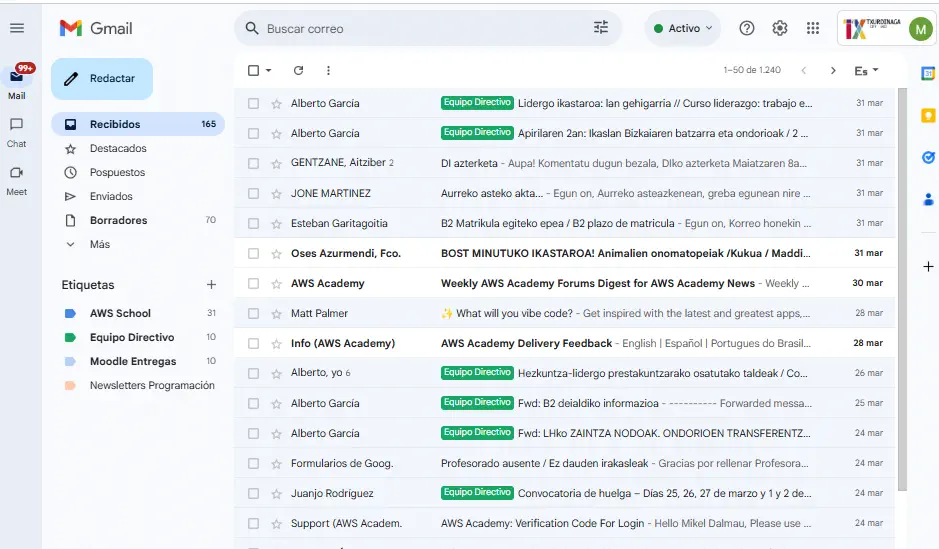
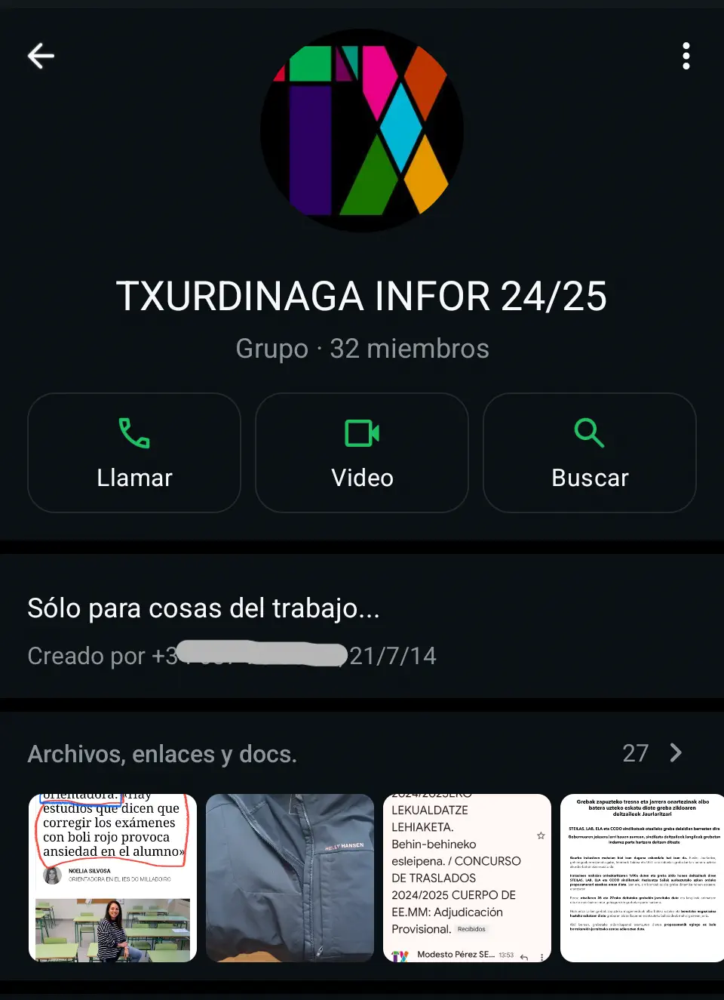
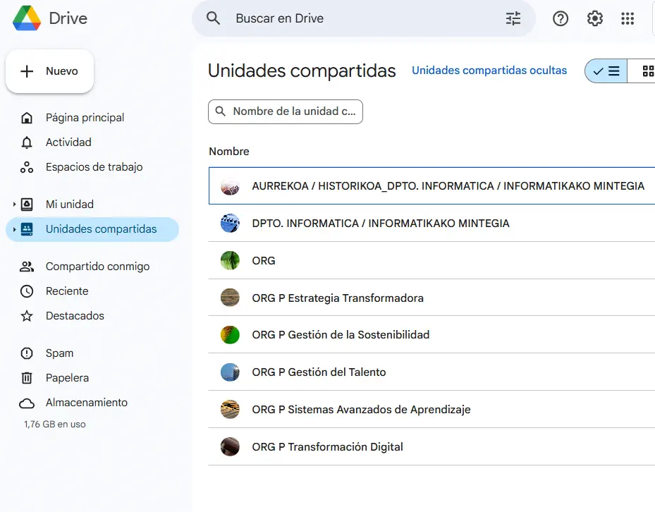

## Correo electrónico - Gmail

El correo electrónico es una de las herramientas principales que utilizamos en el centro para la comunicación entre el profesorado.

En nuestro caso, utilizamos **Gmail** en vez de otro proveedor por simplicidad operativa y porque utilizamos otros servicios de google como **Google Drive**.

Al tratarse de una herramienta de comunicación **asíncrona**, generalemente utilizamos el correo para:

- Comunicaciones generales a todo el profesorado por parte del equipo directivo.
- Comunicaciones generales a los profesores de un departamento por parte del jefe de departamento.
- Comunicaciones generales a los docentes de un ciclo.
- Comunicaciones individuales que no requieran de respuesta inmediata.
- Comunicaciones individuales con el alumnado.

Cómo puede apreciarse en la captura, clasifico el correo con etiquetas para tenerlo más ordenado y sea más clara la lectura.

## Chats - Whatsapp 

Las chat son también una herramienta de comunicación importante en el centro, aunque no tanto como el correo electrónico. 

Dado que principalmente accedemos al **Whatsapp** mediante móvil, se trata de un medio de comunicación más intrusivo y utilizado más para **comunicaciones síncronas** y que requieran de **inmediatez o urgencia**. Por ello, se procura hacer un uso más comedido de los chats y respetando los horarios laborales siempre que es posible.

Los usos incluyen:

- Avisos al grupo del departamento; para cubrir un retraso por tráfico, cubrir una falta, profesores que se han olvidado algo, inicidencias, etc
- Comunicaciones uno a uno entre profesores.
- Cambios de última hora que requieran inmediatez en su comunicación.
- Publicación de noticias o enlaces de interes relativos al trabajo y que atañen al departamento.

A continuación, se muestra una captura del grupo de whatsapp del departamento al que pertenezco:

## Nube - Google Drive

En el centro, la herramienta que utilizamos como sistema de información y comunicación es **Google Drive**. 

Aquí, toda la información está disponible y clasificada para que el profesorado pueda acceder y coordinarse gracias a los documentos que se actualizan en vivo y al momento. 

Se trata de una herramienta de comunicación asíncrona que muchas veces complementa al correo electrónico, ya que los correos suelen incluir enlaces a documentos como listas en las que apuntarse, normativas, protocolos etc.

