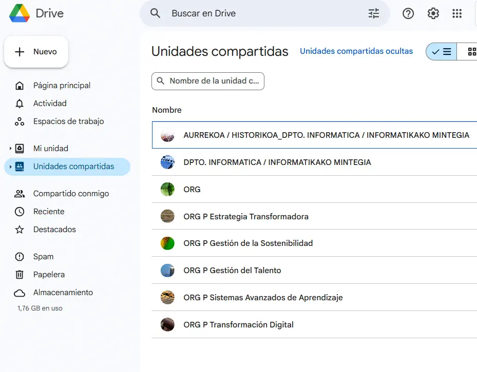
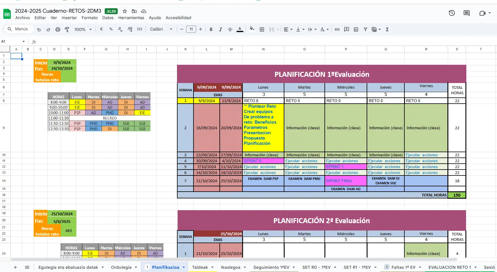
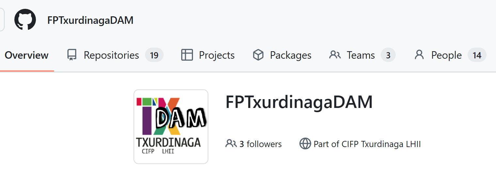
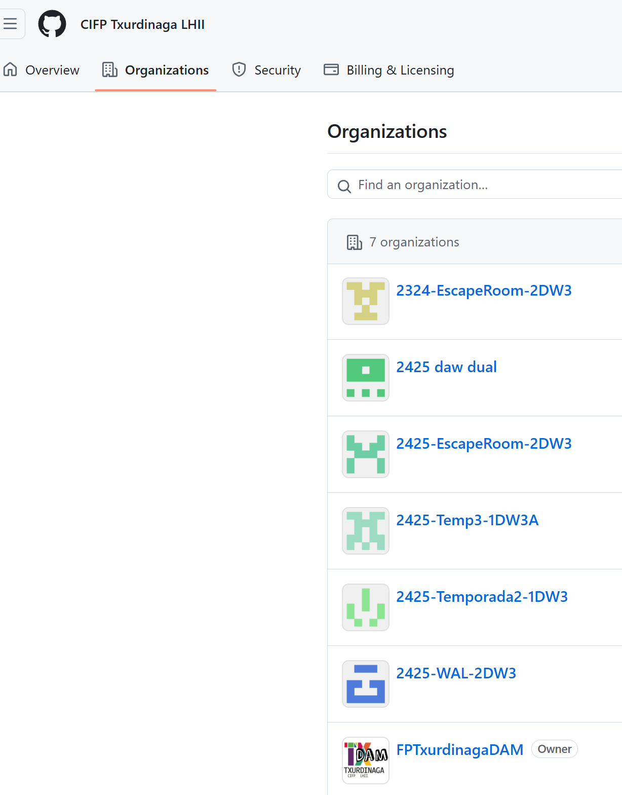
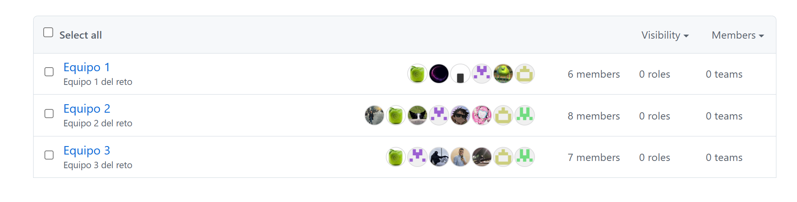

-- # 1B Contexto de colaboración

- [Nube - Google Drive](#nube---google-drive)
- [Cuaderno del profesor](#cuaderno-del-profesor)
- [Repositorios de GitHub](#repositorios-de-github)

## Nube - Google Drive

En el centro, la herramienta que utilizamos como sistema de información y colaboración es **Google Drive**. 

Aquí, toda la información está disponible y clasificada para que el profesorado pueda acceder y coordinarse gracias a los documentos que se actualizan en vivo y al momento. 

## Cuaderno del profesor

Estos cuadernos son **fundamentales para la colaboración del equipo docente** y se alojan en la nube para manterse actualizados y sincronizados.

Los cuadernos se crean a nivel de modulo y por retos e incluyen aspectos como rúbricas, seguimiento de faltas, planificaciones, horarios, calificaciones, agrupamiento del alumnado etc

## Repositorios de GitHub

Los repositorios de GitHub son la herramienta que utilizamos para almacenar y versionar el código de los proyectos.
Los repositorios se crean a nivel de modulo y por retos y ayudan a evaluar aspectos como la planificación, el seguimiento del alumnado, las entregas, los issues y pull requests, etc.

Github ofrece la posibilidad de crear organizaciones, lo que permite crear equipos de trabajo y crear repositorios privados con permisos de acceso restringidos a los miembros del equipo y el profesorado.

A continuación se muestra una organización creada para la asignatura de **Desarrollo de Aplicaciones Multiplataforma**. En esta organización se pueden ver los diferentes equipos de trabajo y los repositorios creados por cada uno de ellos.

A nivel de centro, todos estas organizaciones se agrupan en una Enterprise **CIFP Txurdinaga LHII**. En esta organización se pueden ver los diferentes módulos y asignaturas que se imparten en el centro y los repositorios creados por cada uno de ellos.

