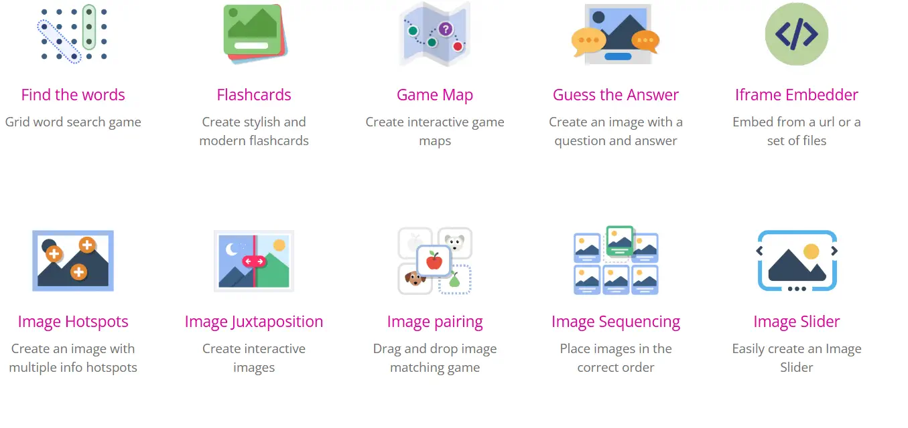

# 2.A Contenido Básico

A continuación se muestra un contenido que he enriquecido mediante la utilización de elementos [H5P](https://h5p.org/content-types-and-applications). Los elementos, H5P son un conjunto de componente que permiten y facilitan la creación de contenido interactivo y se pueden integrar en Moodle, Drupal, Wordpress u otra web, tal y como lo hago aquí. La siguiente imagen muestra algunos ejemplos, [pueden previsualizarse todos en la web]([H5P](https://h5p.org/content-types-and-applications)).

<br/>




## Introducción a Jetpack Compose

**Jetpack Compose** es el kit moderno de herramientas de Android para crear interfaces de usuario declarativas. En lugar de basarte en XML o vistas imperativas, Compose te permite describir la UI usando funciones llamadas *composables*, que reaccionan a cambios de estado de manera fluida. Sus ventajas principales son:

- **Menos código repetitivo** al construir interfaces.  
- **Reactividad**: la UI se actualiza cuando cambia el estado subyacente.  
- **Integración** con otras APIs de Jetpack (ViewModel, LiveData, etc.).  
- **Modularidad**: cada componente se escribe como una función composable independiente, lo que facilita la lectura y el mantenimiento.

---

### Elementos básicos de Jetpack Compose

1. **Funciones composable**  
   - Se anotan con `@Composable`.  
   - Definen qué UI se pinta en pantalla.  
   - Ejemplo rápido:
    
     ```kotlin
     @Composable
     fun Saludo(name: String) {
         Text(text = "Hola, $name")
     }
     ```

2. **Vista previa**  
   - Para ver resultados en el IDE (Android Studio), se puede usar `@Preview`.  
   - Ejemplo de función de vista previa:
  
     ```kotlin
     @Preview(showBackground = true)
     @Composable
     fun PreviewSaludo() {
         Saludo(name = "Mundo")
     }
     ```

3. **State y Recomposition**  
   - Si el contenido depende de un estado (variable), Compose lo reevaluará cuando ese estado cambie, actualizando la UI automáticamente.  
   - Ejemplo con un `remember` y un `mutableStateOf`:
     ```kotlin
     @Composable
     fun Contador() {
         var count by remember { mutableStateOf(0) }
         Button(onClick = { count++ }) {
             Text("Has hecho clic $count veces")
         }
     }
     ```

4. **Column, Row y Box**  
   - Para estructurar la UI, Compose ofrece elementos de layout como `Column`, `Row` y `Box`.  
   - Ejemplo:
     ```kotlin
     @Composable
     fun VistaBasica() {
         Column {
             Text("Texto en la parte superior")
             Row {
                 Text("Texto a la izquierda")
                 Text("Texto a la derecha")
             }
         }
     }
     ```

---

## 3. Ejemplo práctico: formulario sencillo

Supongamos que quieres crear un formulario con dos campos de texto y un botón de envío. Se podría hacer así:

```kotlin
@Composable
fun FormularioSimple() {
    var texto1 by remember { mutableStateOf("") }
    var texto2 by remember { mutableStateOf("") }

    Column {
        TextField(
            value = texto1,
            onValueChange = { texto1 = it },
            label = { Text("Campo 1") }
        )
        TextField(
            value = texto2,
            onValueChange = { texto2 = it },
            label = { Text("Campo 2") }
        )
        Button(onClick = {
            // Lógica de envío o validación
        }) {
            Text("Enviar")
        }
    }
}
```

Con esto, al escribir en cada campo, se actualiza la variable correspondiente y Compose **recompone** la UI reflejando los cambios.

---

## 4. Ejemplos de microactividades H5P

Para reforzar este contenido, se pueden crear varias **actividades breves** (mini “quizzes” o “ejercicios interactivos”) que los estudiantes puedan resolver al avanzar en el curso. A continuación, algunas sugerencias:

### 4.1. Opción Múltiple (Multiple Choice)

- **Título**: “¿Qué es Jetpack Compose?”
- **Pregunta**: “Selecciona la mejor definición de Jetpack Compose:”
  1. Un *framework* que reemplaza automáticamente todo tu proyecto Gradle.  
  2. El kit moderno de herramientas declarativas de Android para construir interfaces de usuario.  
  3. Una librería para automatizar tests de interfaz.  

- **Respuesta correcta**: Opción 2.  
- **Feedback**:  
  - Para la Opción 1: “Compose no reemplaza tu configuración de Gradle, solo mejora la forma de crear UIs.”  
  - Para la Opción 2: “¡Correcto! Compose es la manera declarativa y moderna de crear interfaces en Android.”  
  - Para la Opción 3: “Compose no es para pruebas; aunque existe *Jetpack Compose Testing*, no es lo mismo que la propia herramienta para construir UI.”

### 4.2. Drag & Drop (Arrastrar y Soltar)

- **Objetivo**: Ordenar los pasos necesarios para crear una vista con Jetpack Compose.  
- **Instrucciones**: Arrastra los pasos al orden correcto:
  1. Anotar la función con `@Composable`.  
  2. Escribir la función con el contenido UI (Text, Button, etc.).  
  3. (Opcional) Añadir una función de `@Preview` para mostrar la vista en el IDE.

- **Orden Correcto**:  
  1. Anotar la función con `@Composable`.  
  2. Escribir el contenido de UI dentro.  
  3. Añadir `@Preview` si se desea ver en Android Studio.

### 4.3. Fill in the Blanks (Rellenar espacios)

- **Ejemplo**: Mostrar un pequeño trozo de código con huecos para rellenar.  
  ```kotlin
  @Composable
  fun Contador() {
      var count by remember { _____ }
      Button(onClick = { count++ }) {
          Text("Has hecho clic $count veces")
      }
  }
  ```
- **Palabras clave para completar**: `mutableStateOf(0)`, `mutableStateOf("")`, `State`, etc.  
  - La respuesta correcta en este caso sería: `mutableStateOf(0)`.  
- **Feedback**: si ponen otra cosa, se explica por qué no es correcta.

### 4.4. Quiz (Question Set) para evaluación rápida

- Un “Question Set” que combine preguntas de opción múltiple y verdadero/falso:  
  - **Pregunta 1 (Opción múltiple)**: “¿Qué anotación define una función composable?” (Respuesta: `@Composable`)  
  - **Pregunta 2 (Verdadero/Falso)**: “La interfaz en Compose se crea de forma imperativa, añadiendo vistas manualmente.” (Falso)  
  - **Pregunta 3 (Opción múltiple)**: “¿Cuál es la ventaja principal de un layout como Column o Row?”  
    1. Agrupar componentes en una columna o fila de forma declarativa.  
    2. Añadir estilos en tiempo de ejecución.  
    3. Sustituir completamente el XML.  

    (La más acertada para la “ventaja principal” podría ser la 1.)

---

## 5. Estructura de la lección (ejemplo)

Puedes integrar estos pequeños H5P en un recurso “Course Presentation” o en secciones individuales. Por ejemplo:

1. **Sección 1**: Introducción a Jetpack Compose  
   - Texto + imágenes de ejemplo + micro-actividad “Opción Múltiple” sobre el concepto general.

2. **Sección 2**: Creando tu primera función composable  
   - Explicación del uso de `@Composable`, `@Preview` y un ejemplo de `Text`.  
   - Actividad “Drag & Drop” para ordenar pasos.

3. **Sección 3**: Manejo de estado (State) y eventos (onClick)  
   - Explicación y código de un contador o un formulario básico.  
   - Actividad “Fill in the Blanks” para rellenar huecos con `mutableStateOf(...)`.

4. **Sección 4**: Pequeño resumen y evaluación  
   - Quiz con preguntas combinadas (Question Set).  
   - Mensaje final de conclusión e invitación a profundizar (enlace a la documentación de Jetpack Compose o codelabs oficiales).

---

## 6. Conclusión

Este plan permite una lección **breve y dinámica** sobre Jetpack Compose, ofreciendo:

- **Explicaciones claras** de los conceptos principales (anotaciones `@Composable`, layouts, estado).  
- **Ejemplos de código** concretos, fácilmente reutilizables en un entorno real de Android Studio.  
- **Actividades H5P simples** (Opción Múltiple, Drag & Drop, Fill in the Blanks, Quiz) para que el alumno refuerce y valide lo aprendido de forma entretenida.

Con estas ideas, podrás montar rápidamente un **recurso educativo** sobre Jetpack Compose, ya sea en un LMS como Moodle o en cualquier plataforma compatible con H5P. ¡Mucho éxito en tu creación de contenido interactivo!