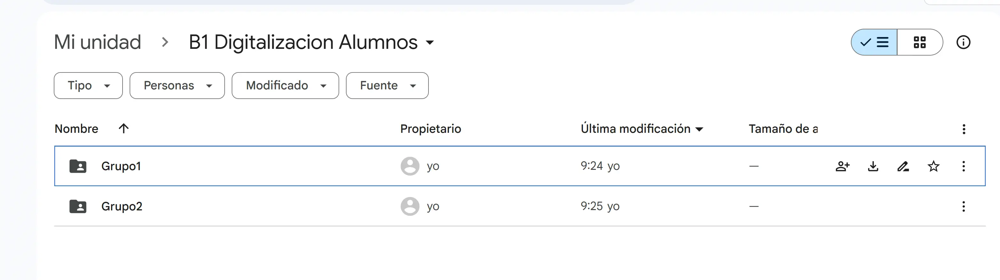
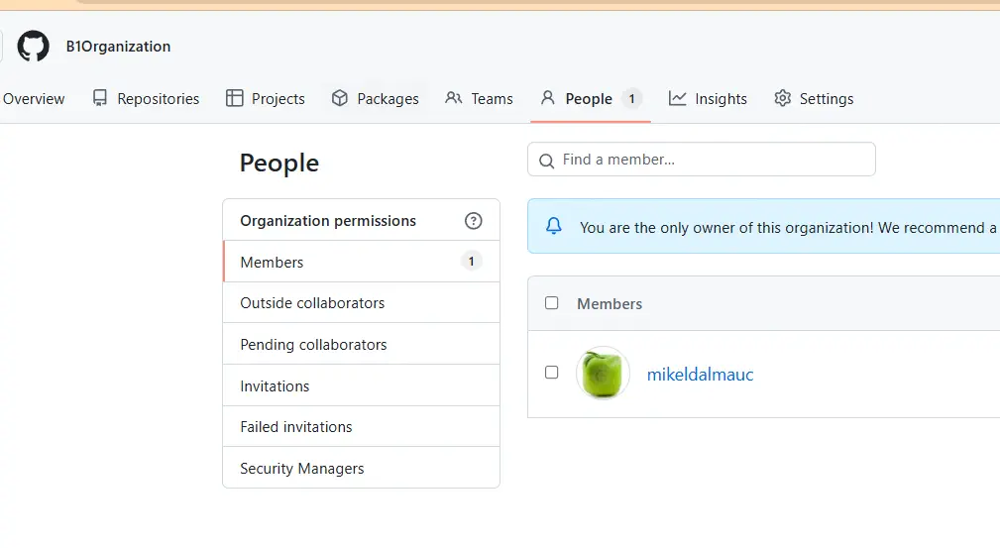
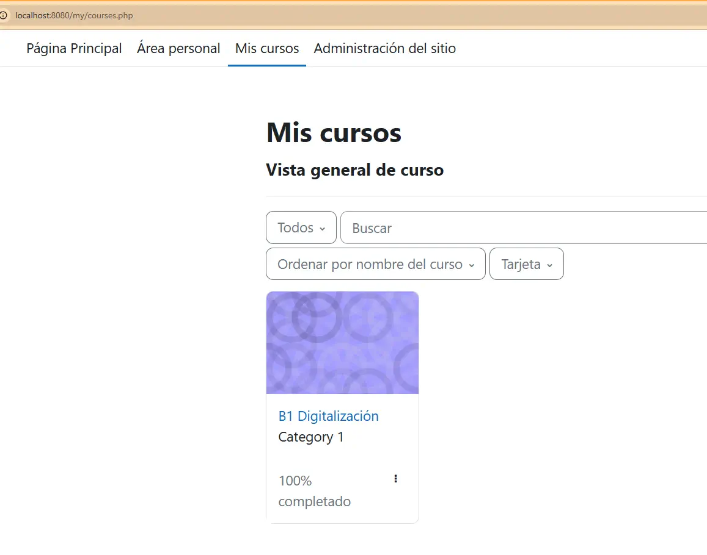
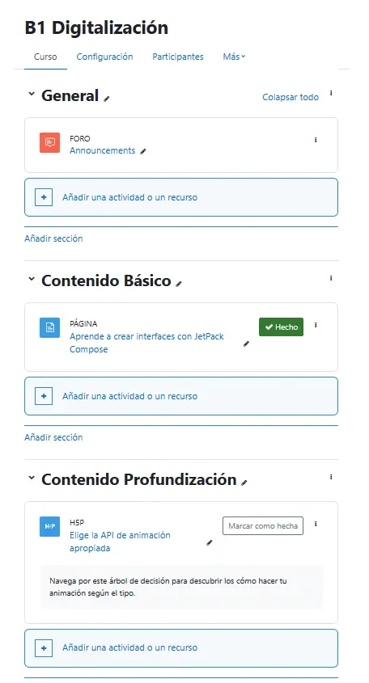

# Contexto colaborativo del alumnado

Para un aprendizaje colaborativo efectivo, es esencial que los alumnos dispongan de las herramientas y aplicaciones correctas que faciliten la colaboración y el trabajo en equipo. Para ello, en primer lugar, ha de comprenderse el contexto y las necesidades del grupo. 

En este caso, el alumnado está compuesto por estudiantes de Formación Profesional del Grado de desarrollo Multiplataforma, y la tipología de proyectos y trabajos que van a realizar requeriran de algunas herramientas específicas a parte de las herramientas de colaboración y comunicación más comunes como Google Drive, Gmail o Moodle.

Herramientas de colaboración:

- [Google Drive](#google-drive) Para compartir documentos, hojas de cálculo y presentaciones.
- [Github](#github): Para el control de versiones y la colaboración en código.
- [Chat](#canales-de-chat): Para la comunicación en tiempo real entre los miembros del equipo, se deja a la elección del alumnado, aunque se recomienda Discord o Slack.
- [Moodle](#moodle): Para la gestión de tareas, la entrega de trabajos, y la comunicación con el profesorado y el resto de alumnos mediante foros y mensajes.

## Google Drive

Para todo lo que es la gestión y creación de documentos, hojas de cálculo y presentaciones se utilizará Google Drive. Podemos ver las ventajas sobre el uso de Google Drive en el apartado de [contexto colaborativo docente](www.mikeldalmau.uk/entregables1b)

A continuación se muestra la carpeta creada en Google Drive para ser usada por los alumnos, de esta forma podemos configurar la gestión de los permisos para que el profesorado sea el propietario y luego cada grupo de alumnos tenga acceso a su carpeta correspondiente. De esta forma se evita que los alumnos puedan borrar o modificar documentos de otros grupos, y el profesorado puede gestionar los permisos de cada grupo de forma sencilla.

## GitHub

[GitHub](https://github.com/) es una herramienta esencial para el control de versiones y la colaboración en proyectos de desarrollo de software. Permite a los equipos trabajar juntos en el mismo código, realizar un seguimiento de los cambios y gestionar las versiones de manera eficiente. Además, GitHub ofrece una serie de características que facilitan la colaboración, como pull requests, issues y wikis. 

Para ello he creado una organización en GitHub llamada [B1 Organization](https://github.com/orgs/B1Organization) donde se pueden crear los repositorios para cada grupo de alumnos. De esta forma, el profesorado puede gestionar los permisos de cada grupo de forma sencilla y evitar que los alumnos puedan borrar o modificar documentos de otros grupos además de ver las estadísticas de actividad de cada grupo.

## Canales de Chat

Esta herramienta no se ha puesto a disposición del alumnado sino que se deja a responsabilidad de cada grupo de alumnos, ya que se trata de herramientas más privadas para comunicarse entre el grupo sin intervención del profesorado. Se recomienda el uso de [Discord](https://discord.com/) o [Slack](https://slack.com/intl/es-es), aunque se puede usar cualquier otra herramienta de chat que permita la comunicación en tiempo real entre los miembros del equipo. La elección de la herramienta dependerá de las preferencias del grupo y de las características específicas del proyecto.

## Moodle

[Moodle](https://moodle.org/?lang=es) es una plataforma de gestión de aprendizaje (LMS) que permite a los profesores crear y gestionar cursos en línea. En este caso, se utilizará Moodle para la gestión de tareas, la entrega de trabajos y la comunicación con el profesorado y el resto de alumnos mediante foros y mensajes.

En las siguientes capturas podemos ver una vista de la plataforma Moodle que creeado en mi servidor personal y un curso creado para el alumnado. En este curso se pueden ver las tareas y actividades que se han creado para el alumnado, así como el Foro o el seguimiento de las actividades entre otros.

