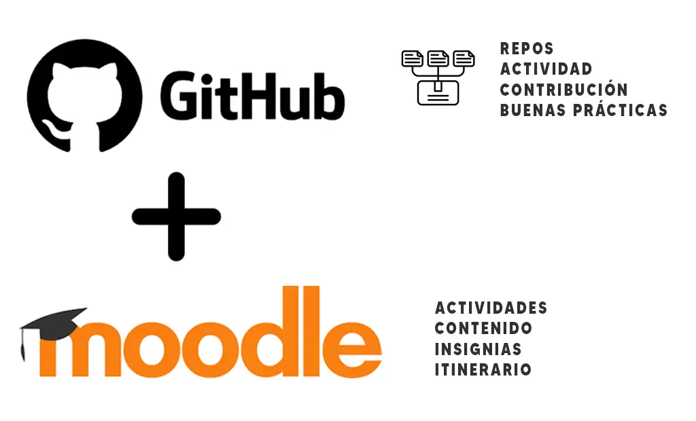
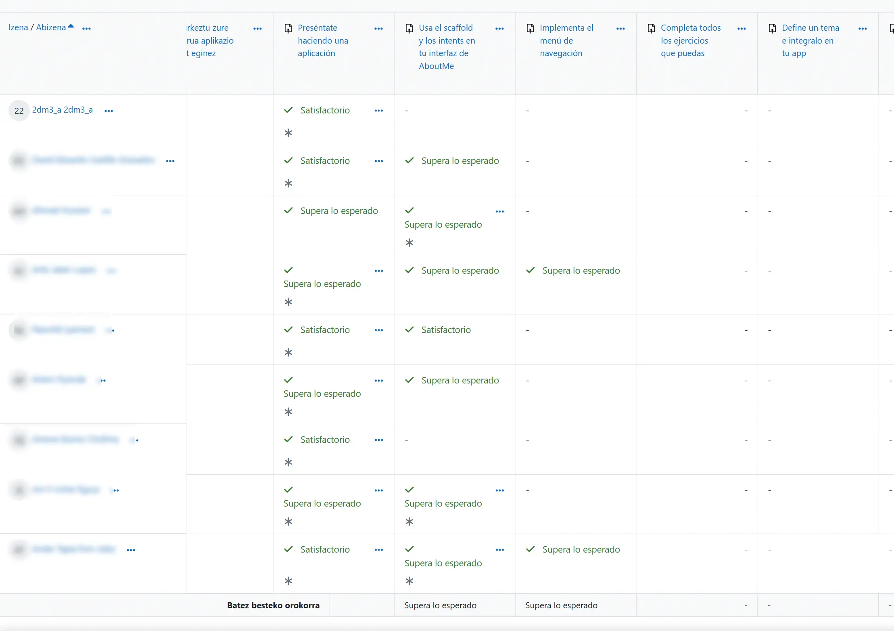

# 4C Estrategia de evaluación formativa utilizando herramientas digitales

- [4C Estrategia de evaluación formativa utilizando herramientas digitales](#4c-estrategia-de-evaluación-formativa-utilizando-herramientas-digitales)
  - [Vídeo explicativo](#vídeo-explicativo)
  - [Herramientas digitales para la evaluación formativa](#herramientas-digitales-para-la-evaluación-formativa)
  - [Elementos que se van a medir en GitHub Classroom](#elementos-que-se-van-a-medir-en-github-classroom)
  - [Elementos que se van a medir en Moodle](#elementos-que-se-van-a-medir-en-moodle)

## Vídeo explicativo

  
  
La evaluación formativa se basa en la observación continua del proceso de aprendizaje, no en pruebas puntuales. Se trata de una evaluación que acompaña el proceso de enseñanza-aprendizaje. 

En este caso, propongo realizar la evaluación formativa a través de Moodle y de Github Classroom.

## Herramientas digitales para la evaluación formativa

**GitHub Classroom** será el entorno donde el alumnado desarrollará sus proyectos de programación de manera individual o grupal.

**¿Por qué usar GitHub Classroom?**

- Permite la creación de repositorios para cada alumno o grupo, facilitando la gestión de tareas.
- Refuerza el aprendizaje basado en proyectos (ABP) y el uso de herramientas reales del entorno laboral.
- Permite un seguimiento objetivo y automatizable del progreso individual.
- Fomenta buenas prácticas y documentación y gestión de versiones.
- Se [integra con numerosos LMSs](https://docs.github.com/en/education/manage-coursework-with-github-classroom/teach-with-github-classroom/connect-a-learning-management-system-course-to-a-classroom)

**Moodle** se usará para organizar el contenido, realizar cuestionarios, rúbricas, y foros de seguimiento además de la evaluación formativa. Esta plataforma permite la creación de actividades y recursos que facilitan la evaluación continua y el feedback inmediato. Se trata además de un LMS ampliamente establecido lo que facilita su adopción por parte del alumnado y profesorado y la integración con otras herramientas digitales.

Como desventaja, tal vez la personalidad y usabilidad de Moodle no sea la más atractiva para el alumnado, pero es una herramienta muy potente y versátil y puede sacarse mucho partido a su uso.

A continuación tenemos una tabla de calificación que podríamos ver en un curso de Moodle:

Tambíen permite al alumno ver su progreso en el curso y el seguimiento de las actividades que ha realizado, lo que mejora mucho la experiencia de aprendizaje y la motivación del alumnado o agregar insinas de progreso en el curso.

## Elementos que se van a medir en GitHub Classroom 

- **Frecuencia de commits**. Historial de commits en el repositorio individual del alumnado
- **Calidad de los mensajes de commit**.	Revisión de buenas prácticas de documentación del código
- **Evolución del código**.	Comparativa entre versiones a lo largo del proyecto
- **Uso de ramas y pull requests**.	Buenas prácticas en control de versiones
- **Participación en el trabajo colaborativo**.	En proyectos grupales, análisis de contribuciones de cada mie

## Elementos que se van a medir en Moodle

- **Cuestionarios**.	Realización de cuestionarios de autoevaluación y evaluación formativa
- **Foros**.	Participación en foros de discusión y resolución de dudas
- **Velocidad de cumplimiento de tareas**.	Seguimiento del progreso del alumnado en el curso
-  **Tareas y proyectos.**	Entrega de tareas y proyectos en el plazo establecido