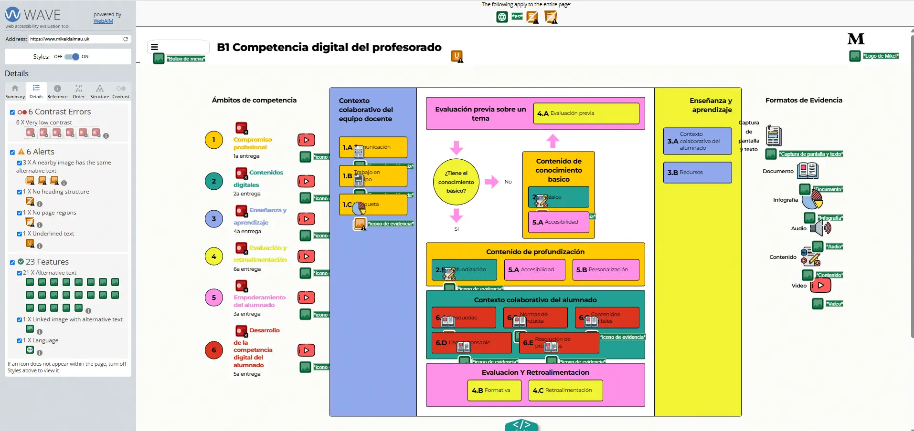
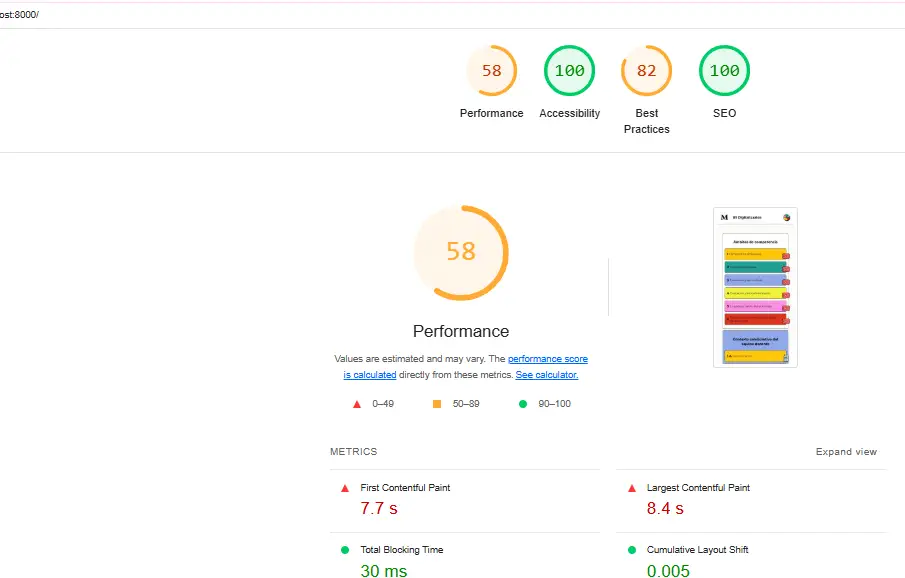
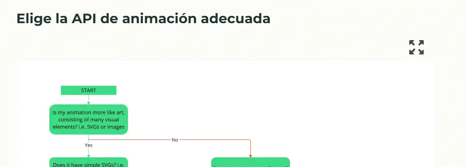

# 5.A: Accesibilidad de los contenidos digitales

- [5.A: Accesibilidad de los contenidos digitales](#5a-accesibilidad-de-los-contenidos-digitales)
  - [Accesibilidad en smartphones](#accesibilidad-en-smartphones)
  - [Uso de imagenes SVG y Webp](#uso-de-imagenes-svg-y-webp)
  - [Contenido expandido](#contenido-expandido)

Para garantizar la accesibildiad de los contenidos digitales, es importante seguir las pautas de accesibilidad web y utilizar herramientas que nos ayuden a evaluar la accesibilidad de nuestros contenidos. En este caso, hemos utilizado la herramienta **WAVE** para analizar la accesibilidad de nuestra web.

Igualmente, he utizalado la herramienta lighthouse de Google Chrome para analizar la accesibilidad de la web. Esta herramienta nos permite evaluar la accesibilidad de nuestra web y nos proporciona recomendaciones para mejorarla. Hay que tener en cuenta que muchas personas no disponen de una buena conexión a internet ni de buenos dispositivos, por lo que es importante que nuestros contenidos sean eficientes, seguros y accesibles desde cualquier dispositivo.

## Accesibilidad en smartphones

Es importante no olvidar que para acceder al contenido digital, es necesario un ordenador o un smartphone. Hay millones de personas que no tienen acceso a un ordenador, pero sí a un smartphone. 

Por lo tanto, es importante que nuestros contenidos sean accesibles desde cualquier dispositivo. Para ello he aplicado algunos cambios en el programa para que sea responsive y se adapte a muchos dispositivos.

## Uso de imagenes SVG y Webp

Es importante utilizar formatos de imagen que sean ligeros y se adapten a cualquier dispositivo. Priorizo utilizar **SVG** y sino transformo las imagens a formato **WebP** que es un formato de imagen ligero y de alta calidad.

## Contenido expandido

He creado un boton para poder expandir contenido que queramos ver en más grande y poder leerlo mejor. Esto es importante para la accesibilidad, ya que muchas personas tienen problemas de visión y necesitan ampliar el contenido para poder leerlo.

