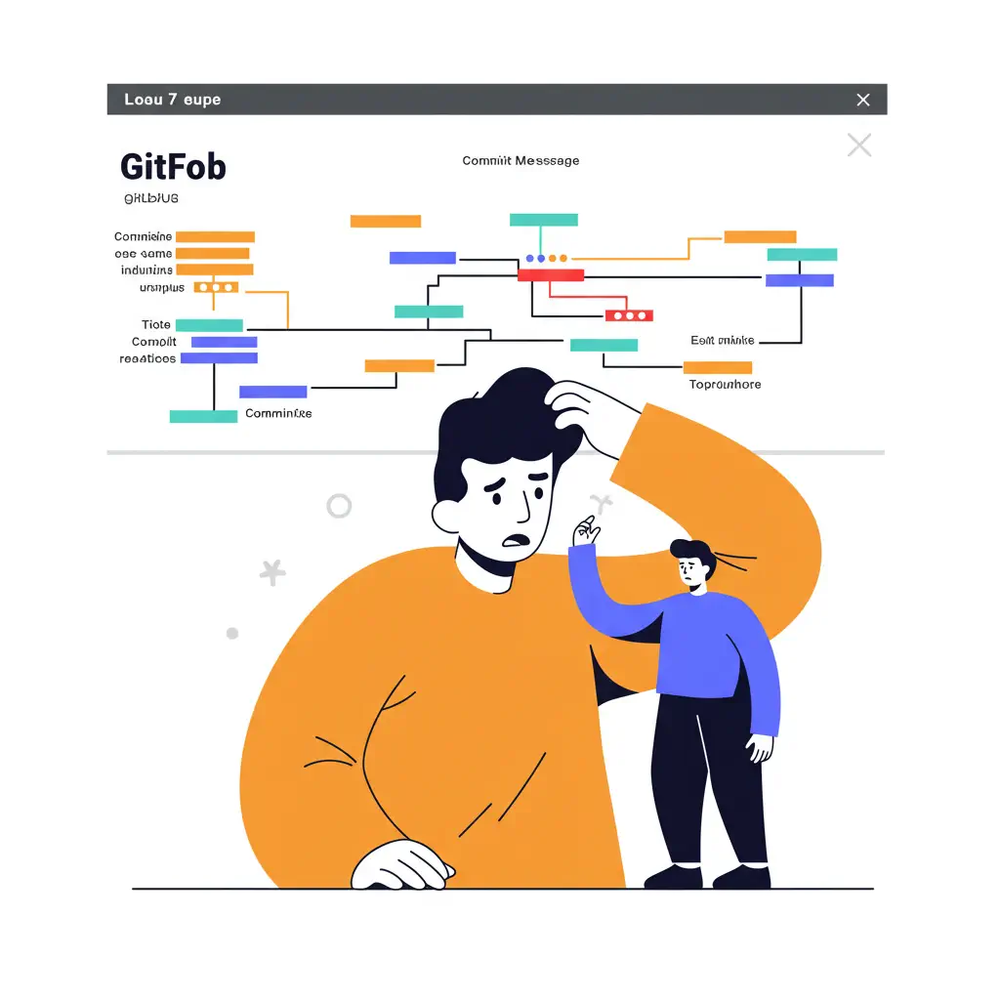

# 6.B: Definición de normas de comportamiento

- [6.B: Definición de normas de comportamiento](#6b-definición-de-normas-de-comportamiento)
  - [Actividad. Normas de colaboracion y netiqueta en GitHub](#actividad-normas-de-colaboracion-y-netiqueta-en-github)
    - [1. Competencia](#1-competencia)
    - [2. Herramientas y recursos necesarios](#2-herramientas-y-recursos-necesarios)
    - [3 Descripcion de la actividad](#3-descripcion-de-la-actividad)
      - [3.1. Introducción, reflexión y diseño de normas](#31-introducción-reflexión-y-diseño-de-normas)
      - [3.2. Puesta en comun y redaccion](#32-puesta-en-comun-y-redaccion)
    - [4. Evidencias](#4-evidencias)
    - [5. Indicadores de logro](#5-indicadores-de-logro)
      - [5.1 Indicadores de logro del documento de netiqueta:](#51-indicadores-de-logro-del-documento-de-netiqueta)
      - [5.2 Indicadores de logro de la observacion del uso de GitHub:](#52-indicadores-de-logro-de-la-observacion-del-uso-de-github)

## Actividad. Normas de colaboracion y netiqueta en GitHub

Esta actividad se puede realizar en una sesión de 2 horas, e idealmente en grupos de 3-4 personas. La actividad está dividad en dos pasos y es una actividad diseñada para ser realizada al comienzo del itinerario formativo ya que en esta se establecen las normas de colaboración y netiqueta que se seguirán durante el resto del curso e introduce a los alumnos en los procesos de publicación, redacción y colaboración en repositorios.

### 1. Competencia

La competencia que se trabajará será: *"Colaboración responsable y efectiva en proyectos de software y repositorios."* y el nivel en el que se trabajará sería medio. 

### 2. Herramientas y recursos necesarios

- **Moodle**: Se publicará una tarea en la que habrá de agregarse el enlace al repositorio de GitHub donde se publicarán las normas de netiqueta y marcar como completada la tarea.
- **GitHub**: Los alumnos publicarán la tarea aquí.
- **VSCode**: Se utilizará para la redacción del documento en Markdown y para la publicación en GitHub.

### 3 Descripcion de la actividad
#### 3.1. Introducción, reflexión y diseño de normas

En esta primera parte se trata de generar un debate e ir introduciendo el tema.

Presentar ejemplos como, “Un equipo sin normas claras en GitHub que acaba en caos (ejemplo real con commits como Update, cambio, asdfg)”.

1. **Dinámica de ideas** guiada tratando de responder a estas preguntas:

   - ¿Qué comportamientos son útiles?
   - ¿Qué problemas pueden surgir sin normas claras?
   - ¿Qué esperamos del trabajo en equipo en entornos digitales?

2. Trabajo en grupos (3-4 personas): **elaboración de un borrador** de normas para el uso de GitHub.

#### 3.2. Puesta en comun y redaccion

3. **Puesta en común de los borradores**. El grupo discute su propuesta y las valora.

4. **Redacción y publicación**. Se han de redactar las normas de uso en formato Markdown y publicarlas en el repositorio individual de cada alumno en un archivo llamado `netiqueta.md`.

### 4. Evidencias

Esta tarea se evidenciará mediante la entrega de la tarea en Moodle y la publicación del documento en el repositorio de GitHub. 

Otras evidencias de que esta competencia se ha adquirido se irán observando a lo largo del curso. Si el alumnado sigue las normas acordadas y se comporta de forma adecuada en el repositorio de GitHub, escribe mensajes de commit claros y descriptivos, y utiliza pull requests y comentarios respetuosos en las revisiones podremos considerar que la actividad ha sido un éxito.

### 5. Indicadores de logro

#### 5.1 Indicadores de logro del documento de netiqueta:
   1. El alumnado ha redactado un documento en formato Markdown con las normas de comportamiento acordadas.
   2. El alumnado ha publicado el documento en su repositorio de GitHub.
   3. El alumnado ha entregado la tarea en Moodle con el enlace al documento de netiqueta en el repositorio.
   4. El alumnado ha tratado al menos 3 de los siguientes puntos:
        1. Formato y contenido del mensaje de commit.
        2. Cuándo hacer pull requests.
        3. Cuándo usar ramas.
        4. Cómo dar feedback en los comentarios.
        5. Conductas a evitar (off-topic, spam, lenguaje poco claro o grosero).

#### 5.2 Indicadores de logro de la observacion del uso de GitHub:

Al tratarse de una competencia que se va a ir observando a lo largo del curso, los indicadores de logro serán más generales y se irán observando en el día a día del uso de GitHub. Estos indicadores son:

1. El alumnado ha definido y redactado unas normas de comportamiento para el uso del repositorio de GitHub (normas de commits, pull requests, branches, issues…).
2. Se observan mensajes de commit descriptivos, coherentes y consistentes según las normas acordadas **la mayoría de las veces**.
3. Se Realiza un uso adecuado de las pull requests, incluyendo descripciones claras de los cambios y comentarios respetuosos en las revisiones **la mayoría de las veces**.
