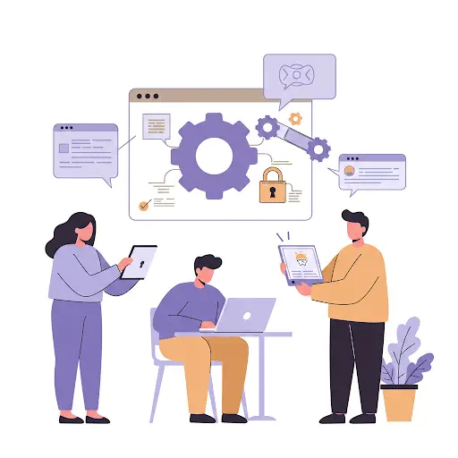

# 6.E Resolución de problemas digitales

- [6.E Resolución de problemas digitales](#6e-resolución-de-problemas-digitales)
  - [Actividad. Resolucion de Incidencias Digitales en Entornos de Desarrollo de Software (con apoyo de IA)](#actividad-resolucion-de-incidencias-digitales-en-entornos-de-desarrollo-de-software-con-apoyo-de-ia)
    - [1. Competencia](#1-competencia)
    - [2. Herramientas y recursos necesarios](#2-herramientas-y-recursos-necesarios)
    - [3. Descripcion de la actividad](#3-descripcion-de-la-actividad)
      - [3.1. Identificacion de incidencias y primeras hipotesis](#31-identificacion-de-incidencias-y-primeras-hipotesis)
      - [3.2. Puesta en practica y resolucion](#32-puesta-en-practica-y-resolucion)
    - [4. Evidencias](#4-evidencias)
    - [5. Indicadores de logro](#5-indicadores-de-logro)

  
  

## Actividad. Resolucion de Incidencias Digitales en Entornos de Desarrollo de Software (con apoyo de IA)

Esta actividad se puede llevar a cabo en una sesión de 2 horas, preferiblemente en grupos de 3 o 4 personas. La idea es que el alumnado aprenda a **identificar** y **solucionar** incidencias frecuentes en proyectos de software, aprovechando también herramientas de inteligencia artificial (por ejemplo, ChatGPT) para facilitar la investigación, sugerir posibles líneas de solución o incluso revisar fragmentos de código. No pretende ser la panacea (a veces la IA dará respuestas incompletas), pero sí un recurso más que el alumno puede usar de forma crítica.

---

### 1. Competencia

La competencia que vamos a trabajar es:  
*"Detectar y solucionar problemas digitales habituales en el entorno de desarrollo de software utilizando recursos diversos, incluidos buscadores y herramientas de IA, aplicando un criterio propio y razonamiento lógico."*  

El nivel en el que nos moveremos es **básico-intermedio**, con énfasis en la **reflexión**, la **comunicación de la solución** y el **pensamiento crítico** ante la información que nos devuelven la IA y otras fuentes.

---

### 2. Herramientas y recursos necesarios

- **Moodle**: Donde subiremos la entrega y habilitaremos un foro para preguntas y pistas.  
- **IA generativa (ChatGPT, Bard o similar)**: Para explorar dudas, pedir sugerencias sobre errores, revisar fragmentos de código… (pero sin olvidar verificar la información).  
- **Repositorio de Git (GitHub o GitLab)**: Para simular incidencias o conflictos en el proyecto.  
- **VSCode** u otro IDE: Para probar y corregir el código.  
- **Documentación oficial y foros** (Stack Overflow, etc).

---

### 3. Descripcion de la actividad

#### 3.1. Identificacion de incidencias y primeras hipotesis

1. **Introducción breve (5-10 min)**  
   El profesor/a explica ejemplos típicos de incidentes en proyectos de software (errores de compilación, dependencias rotas, conflictos de ramas en Git…). No es necesario que sean muy complicados, pero sí reales.

2. **Selección de problemas**  
   - Se lista en Moodle (o en un documento compartido) **3-4 incidencias concretas**. Por ejemplo:  
     1. “Al compilar un proyecto en Node.js, sale un error por versión incompatible de TypeScript.”  
     2. “Conflicto entre rama main y rama feature que bloquea un merge.”  
     3. “El API ha sido expuesto en los commits y hay que eliminarlo del historial.”  
   - Cada grupo elige una de estas incidencias o, si lo prefieren, pueden proponer otra que hayan vivido realmente.

3. **Investigación inicial con IA y foros** (15-20 min)  
   - Cada grupo describe el problema con sus palabras y recopila preguntas para lanzar a la IA.  
   - **Ejemplo de uso de IA**: “¿Cómo puedo eliminar credenciales de un commit histórico en Git?”  
   - Se contrastan las respuestas de la IA con documentación oficial o con foros (es importante que el alumnado se fije en que la IA a veces da respuestas inexactas o incompletas).

#### 3.2. Puesta en practica y resolucion

1. **Implementación y validación** 
   - Los alumnos prueban las indicaciones recopiladas  en un proyecto de ejemplo, o en su propio repositorio simulado para la clase.  
   - Hacen capturas de pantalla de los errores, de los comandos usados, y de cómo validan que el problema esté resuelto.

2. **Informe rápido**  
   - Cada grupo redacta un documento corto en formato Markdown, donde incluyan:
     1. Descripción de la incidencia.  
     2. Pasos que han seguido (incluyendo los prompts a la IA y referencias a docs/foros).  
     3. Solución final.  
     4. Reflexión general sobre el problema y la solucción. 
     5. Reflexión particular sobre la forma en que has resuelto el problema.  
  
3. **Debate grupal (10-15 min)**  
   - Puesta en común de las soluciones: cada grupo presenta lo que hizo bien, dónde tuvo problemas, y se comparten consejos de uso de la IA (qué prompts funcionaron mejor, qué tipo de respuestas no fueron de fiar, etc.).

---

### 4. Evidencias

1. **Entrega en Moodle**: Enlace al documento en Markdown con la descripción y la solución de la incidencia. Cada alumno ha de enlazar a su repositorio personal aunque la actividad se haya hecho en grupo.
   
2. **Participación en el foro**:  
   - Cada grupo comenta al menos un hallazgo importante (por ejemplo, “Nos dimos cuenta de que ChatGPT nos dio una ruta de archivos que no existe, así que tuvimos que buscar en la doc oficial…”).

---

### 5. Indicadores de logro

1. **Identificación clara del problema**: Se describe la incidencia con suficiente detalle, incluyendo cómo se reproduce.  
2. **Uso de IA y foros**: Han consultado de forma efectiva herramientas como ChatGPT o Bard, contrastando la información con otras fuentes y la documentación oficial.  
3. **Solución documentada**: El informe presenta los pasos concretos y explica por qué se optó por la solución elegida.  
4. **Reflexión sobre la IA**: Mencionan si las respuestas fueron correctas, incompletas o si tuvieron que hacer varias iteraciones en los prompts.  
5. **Colaboración y debate**: Participan comentando las soluciones de otros grupos, proponiendo mejoras o complementos.